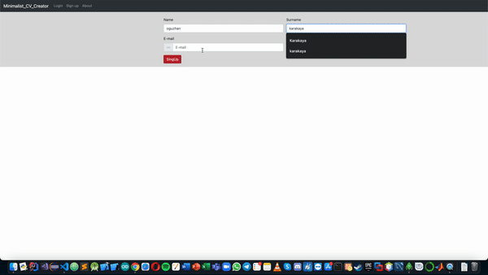
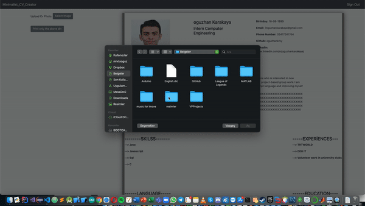
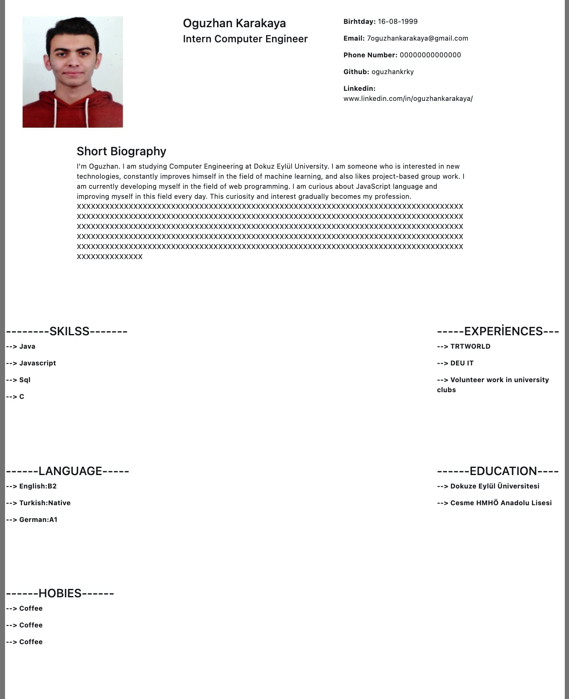

# Minimalist_CV_Creator 
 The Minimalist CV Creator web application simply fills your CV according to the information received after you sign up.  It asks you to choose a picture and you can print the CV with one click or download it to your computer in pdf format.When this web application is opened, it meets you with an uncomplicated and minimal design.The information received from the user is kept in the Mongo database table created.Contains no commercial purpose!!

# Software design pattern 

    ● MVC (Model–view–controller)

# Technologies

### ○ Backend
    ● Node JS 
### ○ Frontend
    ● Html 5 
    ● Css 3
    ● JavaScript
    ● Bootsrap 
### ○ Database 
    ● Mongo DB 

# Instructions For Use
    First 
        Install  MongoDb 
    In terminal 
        ● npm start
    After  Browser 
        ● http://localhost:8000/
        
    You can change your port and database connection in app.js 
    (default port  8000)

# Usage Examples
### ● Sing In & Information Form 
 

### ● Choose Picture & Print CV
 

# Example CV Screenshot
 

#  License 📝
    ● MIT License
